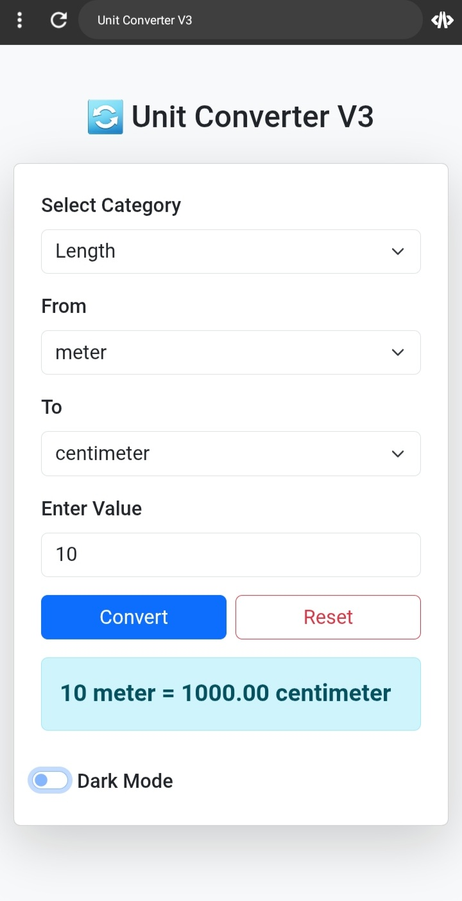

# 🔄 Unit Converter V3

Easily convert between units of length, weight, temperature, and time.  
Built with **HTML**, **Bootstrap**, and **JavaScript** for a clean and responsive UI.

## 🚀 Features
- Multiple categories: Length, Weight, Temperature, Time
- Responsive design with Bootstrap
- Real-time conversion
- User-friendly interface

## 🛠 Technologies Used
- HTML5
- CSS3
- Bootstrap 5
- JavaScript (Vanilla)

---

## 📸 Screenshot

---

## 🇮🇷 مبدل واحد نسخه ۳

یک اپلیکیشن تحت وب برای تبدیل واحدهای طول، وزن، دما و زمان.  
ساخته شده با **HTML**، **Bootstrap** و **JavaScript** با طراحی واکنش‌گرا و رابط کاربری ساده.

### ✨ ویژگی‌ها
- پشتیبانی از دسته‌بندی‌های طول، وزن، دما، زمان
- طراحی واکنش‌گرا با Bootstrap
- تبدیل آنی و دقیق
- رابط کاربری ساده و زیبا

### 🛠 تکنولوژی‌های استفاده شده
- HTML5
- CSS3
- Bootstrap 5
- JavaScript (Vanilla)

---

## 📸 تصویر پروژه

